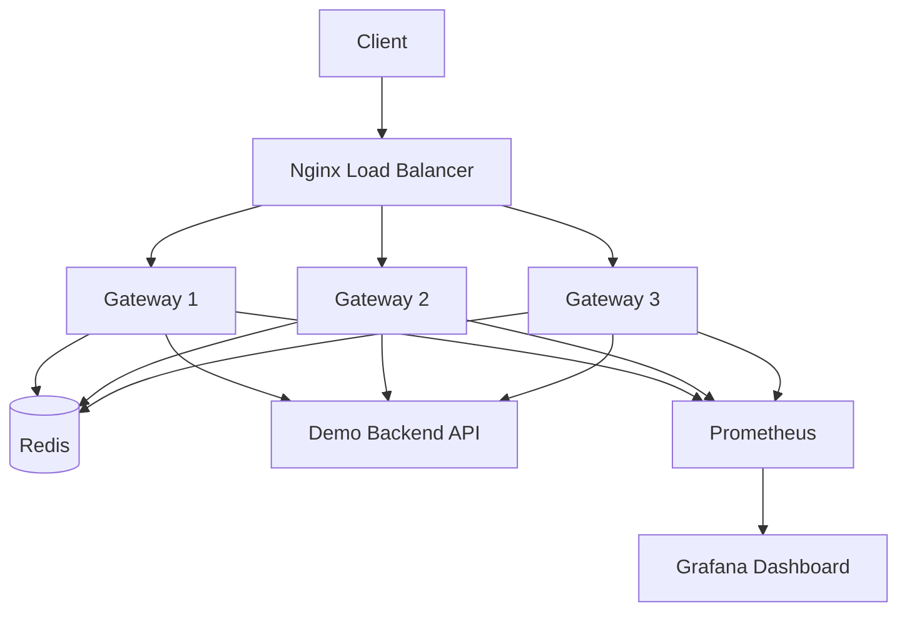
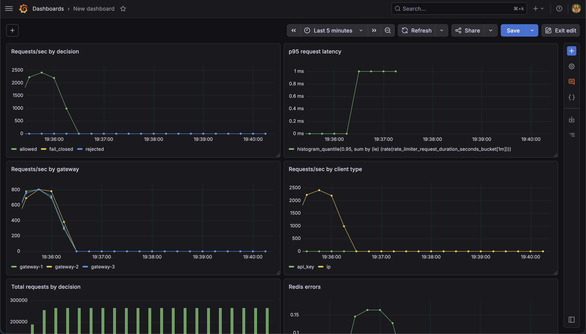

# Distributed Rate Limiter


A production-style distributed rate-limiting gateway built in Go. The service sits in front of a backend API and enforces global request quotas across multiple horizontally scaled gateway instances using Redis-backed token buckets and atomic Lua scripting.

Built as a backend/systems engineering project focused on distributed state, concurrency safety, reverse proxying, load balancing, observability, failure-mode tradeoffs, and performance benchmarking.

## Why This Project Matters

In a horizontally scaled API gateway, local in-memory rate limiting breaks down because each gateway node tracks its own quota independently. If each node allows 10 requests and traffic is spread across 3 nodes, a client could effectively make 30 requests instead of the intended global limit of 10.

This project solves that by storing token bucket state in Redis and updating it atomically with Lua scripts, allowing multiple stateless gateway nodes to enforce a shared global quota.

## Architecture



## Tech Stack

- Go
- Redis
- Redis Lua scripting
- Docker
- Docker Compose
- Nginx
- Prometheus
- Grafana
- k6
- GitHub Actions

## Features

- Distributed token bucket rate limiting
- Redis-backed shared quota state across gateway instances
- Atomic token updates using Redis Lua scripts
- Three horizontally scaled Go gateway nodes
- Nginx round-robin load balancing
- Reverse proxy behavior using Go's `httputil.ReverseProxy`
- API-key based client identification through `X-API-Key`
- IP-based client identification fallback
- Route-specific rate limit policies
- Configurable fail-open / fail-closed Redis failure behavior
- Per-client rate-limit response headers
- Prometheus `/metrics` endpoint
- Grafana dashboard screenshot for observability
- Request count, rejection count, Redis error, and latency metrics
- Docker Compose deployment
- k6 benchmark and correctness tests
- Unit tests for token bucket behavior
- GitHub Actions CI for formatting, tests, builds, and Docker smoke checks

## How It Works

Each request first reaches the Nginx load balancer, which forwards traffic to one of three Go gateway instances.

Each gateway extracts the client identity from the request:

```txt
If X-API-Key exists:
    client_id = api_key:<key>

Otherwise:
    client_id = ip:<client-ip>
```

The gateway then selects a route-specific rate limit policy based on the request path. The Redis bucket key combines the route policy and the client identity:

```txt
rate_limit:route:default:api_key:user-123
rate_limit:route:admin:api_key:user-123
rate_limit:route:search:ip:192.168.65.1
```

The Redis update is performed using a Lua script so that the following operations happen atomically:

```txt
1. Read current token count
2. Calculate refill amount
3. Update token count
4. Decide whether the request is allowed
5. Store the updated bucket state
```

This prevents race conditions when multiple gateway nodes receive requests at the same time.

## Core Design Decisions

### Redis-backed shared state

Each gateway instance is stateless. Token bucket state is stored in Redis so horizontally scaled gateway nodes can enforce a shared global quota.

### Lua scripting for atomicity

The token bucket update is implemented as a Redis Lua script. This makes the read, refill, decrement, and write operations atomic, preventing race conditions under concurrent traffic.

### API-key first, IP fallback

The gateway prefers `X-API-Key` for client identification. If no API key is present, it falls back to IP-based rate limiting.

### Route-specific policies

Different endpoint classes can use different limits.

| Route | Policy | Capacity | Refill Rate |
|---|---|---:|---:|
| `/hello` | default | 10 | 1 token/sec |
| `/search` | search | 20 | 5 tokens/sec |
| `/admin` | admin | 3 | 0.5 tokens/sec |

### Fail-open vs fail-closed Redis behavior

The gateway supports configurable Redis failure behavior.

| Mode | Behavior | Tradeoff |
|---|---|---|
| `FAIL_MODE=closed` | Reject requests when Redis is unavailable | Protects backend, hurts availability |
| `FAIL_MODE=open` | Allows requests when Redis is unavailable | Preserves availability, weakens protection |

The default mode is `closed`.

## Token Bucket Behavior

Each client gets a bucket with:

```txt
capacity = maximum burst size
refill_rate = number of tokens added per second
```

For example:

```txt
capacity = 10
refill_rate = 1 token/second
```

This allows a client to make a burst of 10 requests, then regain 1 allowed request per second. When the client has no tokens left, the gateway returns:

```http
HTTP/1.1 429 Too Many Requests
```

## Rate Limit Headers

Responses include headers such as:

```http
X-Gateway-Instance: gateway-1
X-RateLimit-Client: api_key:user-123
X-RateLimit-Route: default
X-RateLimit-Decision: allowed
X-RateLimit-Fail-Mode: closed
X-RateLimit-Limit: 10
X-RateLimit-Remaining: 9
```

| Header | Description |
|---|---|
| `X-Gateway-Instance` | Gateway node that handled the request |
| `X-RateLimit-Client` | Client identity used for quota enforcement |
| `X-RateLimit-Route` | Route policy applied to the request |
| `X-RateLimit-Decision` | `allowed`, `rejected`, `fail_open`, or `fail_closed` |
| `X-RateLimit-Fail-Mode` | Redis failure behavior |
| `X-RateLimit-Limit` | Bucket capacity |
| `X-RateLimit-Remaining` | Remaining tokens after the request |

## Project Structure

```txt
distributed-rate-limiter/
├── .github/workflows/ci.yml
├── cmd/
│   ├── demo-api/main.go
│   └── gateway/main.go
├── internal/
│   ├── limiter/
│   │   ├── ip_limiter.go
│   │   ├── redis_limiter.go
│   │   ├── token_bucket.go
│   │   └── token_bucket_test.go
│   └── metrics/metrics.go
├── deploy/
│   ├── grafana/
│   ├── nginx/nginx.conf
│   └── prometheus/prometheus.yml
├── docs/images/grafana-dashboard.png
├── loadtest/
│   ├── api-key-test.js
│   ├── basic.js
│   ├── benchmark.js
│   ├── quota-test.js
│   └── route-policy-test.js
├── Dockerfile
├── docker-compose.yml
├── Makefile
├── go.mod
├── go.sum
└── README.md
```

## Running Locally

Start the full distributed system:

```bash
docker compose up --build
```

Or run it in detached mode:

```bash
docker compose up --build -d
```

The system starts:

- 1 Redis container
- 1 demo backend API
- 3 Go gateway containers
- 1 Nginx load balancer
- 1 Prometheus container
- 1 Grafana container

| Service | URL |
|---|---|
| Gateway through Nginx | `http://localhost:8080` |
| Prometheus | `http://localhost:9090` |
| Grafana | `http://localhost:3000` |

Default Grafana credentials:

```txt
username: admin
password: admin
```

## Quick Test

```bash
curl -i http://localhost:8080/hello
```

Example response:

```http
HTTP/1.1 200 OK
X-Gateway-Instance: gateway-1
X-RateLimit-Client: ip:192.168.65.1
X-RateLimit-Decision: allowed
X-RateLimit-Fail-Mode: closed
X-RateLimit-Limit: 10
X-RateLimit-Remaining: 9
X-RateLimit-Route: default
```

Example body:

```json
{
  "message": "hello from backend API",
  "route": "/hello",
  "timestamp": "2026-05-04T23:44:23Z"
}
```

## Demo Commands

### Prove load balancing

```bash
for i in {1..9}; do curl -i -s http://localhost:8080/hello | grep X-Gateway-Instance; done
```

Expected output rotates across all gateway nodes:

```txt
X-Gateway-Instance: gateway-1
X-Gateway-Instance: gateway-2
X-Gateway-Instance: gateway-3
```

### Prove distributed global quota

```bash
docker compose exec redis redis-cli FLUSHALL

for i in {1..20}; do curl -i -s http://localhost:8080/hello | grep -E "HTTP/1.1|X-Gateway-Instance|X-Ratelimit-Remaining|X-Ratelimit-Decision"; echo "---"; done
```

Expected behavior:

```txt
HTTP/1.1 200 OK
X-Gateway-Instance: gateway-1
X-Ratelimit-Remaining: 9
X-Ratelimit-Decision: allowed
---
HTTP/1.1 200 OK
X-Gateway-Instance: gateway-2
X-Ratelimit-Remaining: 8
X-Ratelimit-Decision: allowed
---
...
HTTP/1.1 429 Too Many Requests
X-Ratelimit-Remaining: 0
X-Ratelimit-Decision: rejected
---
```

### Prove API-key based quotas

```bash
docker compose exec redis redis-cli FLUSHALL

for i in {1..12}; do curl -i -s -H "X-API-Key: user-123" http://localhost:8080/hello | grep -E "HTTP/1.1|X-Ratelimit-Client|X-Ratelimit-Remaining"; echo "---"; done

for i in {1..3}; do curl -i -s -H "X-API-Key: user-456" http://localhost:8080/hello | grep -E "HTTP/1.1|X-Ratelimit-Client|X-Ratelimit-Remaining"; echo "---"; done
```

Different API keys receive separate buckets.

### Prove route-specific limits

```bash
docker compose exec redis redis-cli FLUSHALL

for i in {1..6}; do curl -i -s http://localhost:8080/admin | grep -E "HTTP/1.1|X-Ratelimit-Route|X-Ratelimit-Limit|X-Ratelimit-Remaining|X-Ratelimit-Decision"; echo "---"; done
```

Expected behavior:

```txt
/admin allows 3 requests, then returns 429 Too Many Requests
```

```bash
docker compose exec redis redis-cli FLUSHALL

for i in {1..22}; do curl -i -s http://localhost:8080/search | grep -E "HTTP/1.1|X-Ratelimit-Route|X-Ratelimit-Limit|X-Ratelimit-Remaining|X-Ratelimit-Decision"; echo "---"; done
```

Expected behavior:

```txt
/search allows 20 requests, then returns 429 Too Many Requests
```

### Prove independent route buckets

```bash
docker compose exec redis redis-cli FLUSHALL

for i in {1..5}; do curl -i -s -H "X-API-Key: user-123" http://localhost:8080/admin | grep -E "HTTP/1.1|X-Ratelimit-Route|X-Ratelimit-Remaining|X-Ratelimit-Decision"; echo "---"; done

curl -i -H "X-API-Key: user-123" http://localhost:8080/hello

docker compose exec redis redis-cli KEYS "rate_limit:*"
```

Expected Redis keys:

```txt
rate_limit:route:default:api_key:user-123
rate_limit:route:admin:api_key:user-123
```

This proves exhausting `/admin` does not exhaust `/hello`.

## Redis Failure Modes

### Fail-closed mode

With:

```yaml
FAIL_MODE=closed
```

If Redis is unavailable, the gateway rejects requests:

```bash
docker compose stop redis
curl -i http://localhost:8080/hello
docker compose start redis
```

Expected:

```http
HTTP/1.1 503 Service Unavailable
X-RateLimit-Decision: fail_closed
X-RateLimit-Fail-Mode: closed
```

### Fail-open mode

With:

```yaml
FAIL_MODE=open
```

If Redis is unavailable, the gateway allows requests through to the backend:

```bash
docker compose stop redis
curl -i http://localhost:8080/hello
docker compose start redis
```

Expected:

```http
HTTP/1.1 200 OK
X-RateLimit-Decision: fail_open
X-RateLimit-Fail-Mode: open
```

The default mode is `closed`.

## Observability

The gateway exposes Prometheus metrics at:

```http
GET /metrics
```

Prometheus scrapes all three gateway instances directly:

```txt
gateway-1:8080
gateway-2:8080
gateway-3:8080
```

Custom metrics include:

```txt
rate_limiter_requests_total
rate_limiter_redis_errors_total
rate_limiter_request_duration_seconds
```

Example metric:

```txt
rate_limiter_requests_total{client_type="ip",decision="allowed",instance="gateway-1",status_code="200"} 3
```

### Prometheus

Open:

```txt
http://localhost:9090
```

Go to:

```txt
Status -> Target health
```

Expected targets:

```txt
gateway-1:8080    UP
gateway-2:8080    UP
gateway-3:8080    UP
prometheus:9090   UP
```

### Grafana Dashboard

Open:

```txt
http://localhost:3000
```

The dashboard visualizes:

- Requests/sec by decision
- Requests/sec by gateway instance
- Requests/sec by client type
- p95 request latency
- Average request latency
- Redis errors



## Testing

Run Go tests:

```bash
go test ./...
```

Current unit tests cover the in-memory token bucket algorithm, including:

- Allowing requests until capacity is exhausted
- Rejecting requests when the bucket is empty
- Refilling over time
- Preventing refill above capacity
- Rejecting requests when less than one full token has refilled

Run formatting:

```bash
gofmt -w .
```

## Load Testing

This project uses k6 for load testing.

Install k6 on macOS:

```bash
brew install k6
```

Run the basic load test:

```bash
k6 run loadtest/basic.js
```

Run the quota correctness test:

```bash
k6 run loadtest/quota-test.js
```

Run the API-key quota test:

```bash
k6 run loadtest/api-key-test.js
```

Run the route policy test:

```bash
k6 run loadtest/route-policy-test.js
```

Run the benchmark test:

```bash
k6 run loadtest/benchmark.js
```

## Benchmark Result

Local Docker Compose benchmark with:

- 3 Go gateway nodes
- 1 Redis instance
- 1 Nginx load balancer
- 50 virtual users
- 30 second k6 run
- High-throughput benchmark mode with elevated rate limits

| Test | Requests | Throughput | Avg Latency | p95 Latency | Error Rate |
|---|---:|---:|---:|---:|---:|
| Basic load test | 131,913 | ~4,395 req/s | ~1.26ms | ~2.60ms | 0% |

Note: k6 reports intentional `429 Too Many Requests` responses as HTTP failures by default. In quota correctness tests, those 429 responses are expected behavior.

## Configuration

Gateway configuration is controlled through environment variables:

| Variable | Description | Example |
|---|---|---|
| `PORT` | Gateway server port | `8080` |
| `BACKEND_URL` | Backend API URL | `http://demo-api:8081` |
| `REDIS_ADDR` | Redis address | `redis:6379` |
| `INSTANCE_ID` | Gateway instance name | `gateway-1` |
| `RATE_LIMIT_CAPACITY` | Default maximum burst size | `10` |
| `RATE_LIMIT_REFILL_RATE` | Default tokens refilled per second | `1` |
| `FAIL_MODE` | Redis failure behavior, either `open` or `closed` | `closed` |

Example Docker Compose gateway config:

```yaml
environment:
  - PORT=8080
  - BACKEND_URL=http://demo-api:8081
  - REDIS_ADDR=redis:6379
  - INSTANCE_ID=gateway-1
  - RATE_LIMIT_CAPACITY=10
  - RATE_LIMIT_REFILL_RATE=1
  - FAIL_MODE=closed
```

## Useful Commands

Start the system:

```bash
make up
```

Start in detached mode:

```bash
make up-detached
```

Stop and remove containers/volumes:

```bash
make down
```

Clear Redis state:

```bash
make flush
```

Run Go tests:

```bash
make test
```

Run quota test:

```bash
make quota
```

Run API-key quota test:

```bash
make api-key-test
```

Run route policy test:

```bash
make route-policy-test
```

Run benchmark:

```bash
make benchmark
```

## Continuous Integration

This project uses GitHub Actions CI to verify the project on every push and pull request.

The workflow checks:

- Go dependency download
- Go formatting
- Go unit tests
- Binary builds
- Docker Compose build
- Docker Compose startup
- Gateway `/health` endpoint
- Gateway reverse proxy behavior through `/hello`
- Prometheus `/metrics` endpoint

## Future Improvements

- Add Redis Cluster support
- Add sliding window rate limiting
- Add leaky bucket rate limiting
- Add Kubernetes manifests
- Add route policies through a config file instead of hardcoded mappings
- Add configurable per-plan quotas
- Add integration tests for distributed quota behavior
- Add structured JSON logs
- Add OpenTelemetry tracing

## Resume Bullet

```txt
Built a distributed rate-limiting gateway in Go with Redis-backed token buckets, atomic Lua scripting, API-key/IP quotas, route-specific policies, configurable Redis failure modes, Prometheus/Grafana observability, Nginx load balancing, and 3 containerized gateway nodes; benchmarked locally with k6 at ~4.4k req/s and ~2.6ms p95 latency.
```
