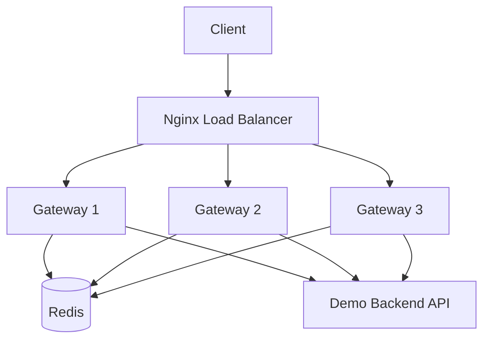

# Distributed Rate Limiter


A distributed rate-limiting gateway built in Go. The service sits in front of a backend API and enforces global request limits across multiple gateway instances using Redis-backed token buckets.

Built as a backend/systems engineering project focused on distributed state, atomic updates, reverse proxying, load balancing, observability, failure-mode tradeoffs, and performance benchmarking.

## Overview

This project implements a production-style distributed rate limiter that can be placed in front of an API to protect backend services from excessive traffic, noisy neighbors, or abusive clients.

The gateway supports:

- Reverse proxying requests to a backend API
- Per-client token bucket rate limiting
- API-key based quota enforcement
- IP-based fallback quota enforcement
- Shared distributed state through Redis
- Atomic quota updates using Redis Lua scripting
- Route-specific rate limit policies
- Configurable fail-open / fail-closed Redis failure behavior
- Horizontal scaling across multiple gateway nodes
- Nginx load balancing
- Prometheus metrics
- Docker Compose deployment
- k6 load testing
- Unit tests for the core token bucket algorithm
- GitHub Actions CI

## Architecture



## Tech Stack

- Go
- Redis
- Redis Lua scripting
- Docker
- Docker Compose
- Nginx
- Prometheus
- k6
- GitHub Actions

## Features

- Distributed token bucket rate limiting
- Redis-backed shared state across gateway instances
- Atomic token updates using Redis Lua scripts
- Three horizontally scaled Go gateway nodes
- Nginx round-robin load balancing
- Reverse proxy behavior using Go's `httputil.ReverseProxy`
- API-key based client identification through `X-API-Key`
- IP-based client identification fallback
- Route-specific rate limit policies
- Configurable fail-open / fail-closed Redis failure behavior
- Per-client rate-limit response headers
- Prometheus `/metrics` endpoint
- Request count metrics
- Rejection count metrics
- Redis error metrics
- Request latency histograms
- Dockerized local deployment
- k6 benchmark tests
- k6 quota correctness tests
- Unit tests for token bucket behavior
- GitHub Actions CI for formatting, tests, builds, and Docker smoke checks

## How It Works

Each request first reaches the Nginx load balancer, which forwards traffic to one of three Go gateway instances.

Each gateway extracts the client identity from the request:

```txt
If X-API-Key exists:
    client_id = api_key:<key>

Otherwise:
    client_id = ip:<client-ip>
```

The gateway then selects a route-specific rate limit policy based on the request path.

The token bucket state is stored in Redis instead of local process memory. This allows all gateway instances to enforce the same global rate limit, even when requests are distributed across multiple containers.

The Redis update is performed using a Lua script so that the following operations happen atomically:

```txt
1. Read current token count
2. Calculate refill amount
3. Update token count
4. Decide whether the request is allowed
5. Store the updated bucket state
```

This prevents race conditions when multiple gateway nodes receive requests at the same time.

## Core Design Decisions

### Redis-backed shared state

Each gateway instance is stateless. Token bucket state is stored in Redis so horizontally scaled gateway nodes can enforce a shared global quota.

### Lua scripting for atomicity

The token bucket update is implemented as a Redis Lua script. This makes the read, refill, decrement, and write operations atomic, preventing race conditions under concurrent traffic.

### API-key first, IP fallback

The gateway prefers `X-API-Key` for client identification. If no API key is present, it falls back to IP-based rate limiting.

### Route-specific policies

Different endpoint classes can use different limits.

| Route | Policy | Capacity | Refill Rate |
|---|---|---:|---:|
| `/hello` | default | 10 | 1 token/sec |
| `/search` | search | 20 | 5 tokens/sec |
| `/admin` | admin | 3 | 0.5 tokens/sec |

### Fail-open vs fail-closed Redis behavior

The gateway supports configurable Redis failure behavior.

| Mode | Behavior | Tradeoff |
|---|---|---|
| `FAIL_MODE=closed` | Reject requests when Redis is unavailable | Protects backend, hurts availability |
| `FAIL_MODE=open` | Allows requests when Redis is unavailable | Preserves availability, weakens protection |

The default mode is `closed`.

## Token Bucket Behavior

Each client gets a bucket with:

```txt
capacity = maximum burst size
refill_rate = number of tokens added per second
```

For example:

```txt
capacity = 10
refill_rate = 1 token/second
```

This allows a client to make a burst of 10 requests, then regain 1 allowed request per second.

When the client has tokens available, the gateway forwards the request to the backend API.

When the client has no tokens left, the gateway returns:

```http
HTTP/1.1 429 Too Many Requests
```

## Client Identification

The gateway supports two forms of client identification.

### API-Key Based Limiting

Requests can include an API key:

```bash
curl -i -H "X-API-Key: user-123" http://localhost:8080/hello
```

This creates a Redis bucket such as:

```txt
rate_limit:route:default:api_key:user-123
```

Different API keys receive separate buckets.

### IP-Based Fallback

If no API key is provided, the gateway falls back to IP-based limiting:

```txt
rate_limit:route:default:ip:<client-ip>
```

This allows the gateway to work with both authenticated and unauthenticated clients.

## Route-Specific Rate Limits

The gateway supports independent Redis-backed buckets per route policy.

Example bucket keys:

```txt
rate_limit:route:default:api_key:user-123
rate_limit:route:admin:api_key:user-123
rate_limit:route:search:api_key:user-123
```

This means exhausting `/admin` does not exhaust `/hello` or `/search`.

Default route:

```bash
curl -i http://localhost:8080/hello
```

Expected headers:

```http
X-RateLimit-Route: default
X-RateLimit-Limit: 10
```

Admin route:

```bash
for i in {1..6}; do curl -i -s http://localhost:8080/admin | grep -E "HTTP/1.1|X-Ratelimit-Route|X-Ratelimit-Limit|X-Ratelimit-Remaining|X-Ratelimit-Decision"; echo "---"; done
```

Expected behavior:

```txt
/admin allows 3 requests, then returns 429 Too Many Requests
```

Search route:

```bash
for i in {1..22}; do curl -i -s http://localhost:8080/search | grep -E "HTTP/1.1|X-Ratelimit-Route|X-Ratelimit-Limit|X-Ratelimit-Remaining|X-Ratelimit-Decision"; echo "---"; done
```

Expected behavior:

```txt
/search allows 20 requests, then returns 429 Too Many Requests
```

## Redis Failure Modes

The gateway supports configurable Redis failure behavior.

### Fail-closed mode

With:

```yaml
FAIL_MODE=closed
```

If Redis is unavailable, the gateway rejects requests:

```bash
docker compose stop redis
curl -i http://localhost:8080/hello
```

Expected:

```http
HTTP/1.1 503 Service Unavailable
X-RateLimit-Decision: fail_closed
X-RateLimit-Fail-Mode: closed
```

### Fail-open mode

With:

```yaml
FAIL_MODE=open
```

If Redis is unavailable, the gateway allows requests through to the backend:

```bash
docker compose stop redis
curl -i http://localhost:8080/hello
```

Expected:

```http
HTTP/1.1 200 OK
X-RateLimit-Decision: fail_open
X-RateLimit-Fail-Mode: open
```

Default mode is `closed`.

## Rate Limit Headers

Responses include headers such as:

```http
X-Gateway-Instance: gateway-1
X-RateLimit-Client: api_key:user-123
X-RateLimit-Route: default
X-RateLimit-Decision: allowed
X-RateLimit-Fail-Mode: closed
X-RateLimit-Limit: 10
X-RateLimit-Remaining: 9
```

`X-Gateway-Instance` shows which gateway node handled the request.

`X-RateLimit-Client` shows which client identity was used.

`X-RateLimit-Route` shows which route policy was applied.

`X-RateLimit-Decision` shows whether the request was allowed, rejected, fail-opened, or fail-closed.

## Project Structure

```txt
distributed-rate-limiter/
├── .github/
│   └── workflows/
│       └── ci.yml
├── cmd/
│   ├── demo-api/
│   │   └── main.go
│   └── gateway/
│       └── main.go
├── internal/
│   ├── limiter/
│   │   ├── ip_limiter.go
│   │   ├── redis_limiter.go
│   │   ├── token_bucket.go
│   │   └── token_bucket_test.go
│   └── metrics/
│       └── metrics.go
├── deploy/
│   └── nginx/
│       └── nginx.conf
├── loadtest/
│   ├── api-key-test.js
│   ├── basic.js
│   ├── benchmark.js
│   ├── quota-test.js
│   └── route-policy-test.js
├── Dockerfile
├── docker-compose.yml
├── Makefile
├── go.mod
├── go.sum
└── README.md
```

## Running Locally

Start the full distributed system:

```bash
docker compose up --build
```

Or run it in detached mode:

```bash
docker compose up --build -d
```

The system starts:

- 1 Redis container
- 1 demo backend API
- 3 Go gateway containers
- 1 Nginx load balancer

## Test the Gateway

Send a request through Nginx:

```bash
curl -i http://localhost:8080/hello
```

Example response:

```http
HTTP/1.1 200 OK
X-Gateway-Instance: gateway-1
X-RateLimit-Client: ip:192.168.65.1
X-RateLimit-Decision: allowed
X-RateLimit-Fail-Mode: closed
X-RateLimit-Limit: 10
X-RateLimit-Remaining: 9
X-RateLimit-Route: default
```

Example body:

```json
{
  "message": "hello from backend API",
  "route": "/hello",
  "timestamp": "2026-05-04T23:44:23Z"
}
```

## Proving Load Balancing

Run:

```bash
for i in {1..9}; do curl -i -s http://localhost:8080/hello | grep X-Gateway-Instance; done
```

Expected output:

```txt
X-Gateway-Instance: gateway-1
X-Gateway-Instance: gateway-2
X-Gateway-Instance: gateway-3
X-Gateway-Instance: gateway-1
X-Gateway-Instance: gateway-2
X-Gateway-Instance: gateway-3
```

This proves Nginx is rotating traffic across the three gateway nodes.

## Proving Distributed Rate Limiting

First clear Redis:

```bash
docker compose exec redis redis-cli FLUSHALL
```

Then run:

```bash
for i in {1..20}; do curl -i -s http://localhost:8080/hello | grep -E "HTTP/1.1|X-Gateway-Instance|X-Ratelimit-Remaining"; echo "---"; done
```

Expected behavior:

```txt
HTTP/1.1 200 OK
X-Gateway-Instance: gateway-1
X-Ratelimit-Remaining: 9
---
HTTP/1.1 200 OK
X-Gateway-Instance: gateway-2
X-Ratelimit-Remaining: 8
---
HTTP/1.1 200 OK
X-Gateway-Instance: gateway-3
X-Ratelimit-Remaining: 7
---
...
HTTP/1.1 429 Too Many Requests
X-Gateway-Instance: gateway-2
X-Ratelimit-Remaining: 0
---
```

This proves that all gateway nodes share the same Redis-backed token bucket.

Without Redis, each gateway would have its own independent bucket. With Redis, the rate limit is enforced globally across all instances.

## Proving API-Key Based Quotas

Clear Redis:

```bash
docker compose exec redis redis-cli FLUSHALL
```

Send 12 requests as `user-123`:

```bash
for i in {1..12}; do curl -i -s -H "X-API-Key: user-123" http://localhost:8080/hello | grep -E "HTTP/1.1|X-Ratelimit-Client|X-Ratelimit-Remaining"; echo "---"; done
```

Expected behavior:

```txt
HTTP/1.1 200 OK
X-Ratelimit-Client: api_key:user-123
X-Ratelimit-Remaining: 9
---
...
HTTP/1.1 200 OK
X-Ratelimit-Remaining: 0
---
HTTP/1.1 429 Too Many Requests
X-Ratelimit-Remaining: 0
---
```

Now send requests as a different API key:

```bash
for i in {1..3}; do curl -i -s -H "X-API-Key: user-456" http://localhost:8080/hello | grep -E "HTTP/1.1|X-Ratelimit-Client|X-Ratelimit-Remaining"; echo "---"; done
```

Expected behavior:

```txt
HTTP/1.1 200 OK
X-Ratelimit-Client: api_key:user-456
X-Ratelimit-Remaining: 9
---
HTTP/1.1 200 OK
X-Ratelimit-Remaining: 8
---
```

This proves different API keys receive separate rate-limit buckets.

## Proving Independent Route Buckets

Clear Redis:

```bash
docker compose exec redis redis-cli FLUSHALL
```

Exhaust `/admin` for one API key:

```bash
for i in {1..5}; do curl -i -s -H "X-API-Key: user-123" http://localhost:8080/admin | grep -E "HTTP/1.1|X-Ratelimit-Route|X-Ratelimit-Remaining|X-Ratelimit-Decision"; echo "---"; done
```

Then call `/hello` with the same API key:

```bash
curl -i -H "X-API-Key: user-123" http://localhost:8080/hello
```

Expected:

```http
HTTP/1.1 200 OK
X-RateLimit-Client: api_key:user-123
X-RateLimit-Route: default
X-RateLimit-Remaining: 9
```

This proves exhausting `/admin` does not exhaust `/hello`.

## Inspecting Redis State

Open Redis CLI:

```bash
docker compose exec redis redis-cli
```

List rate-limit keys:

```redis
KEYS rate_limit:*
```

Example output:

```txt
1) "rate_limit:route:default:api_key:user-123"
2) "rate_limit:route:admin:api_key:user-123"
3) "rate_limit:route:search:api_key:user-123"
```

Inspect a bucket:

```redis
HGETALL rate_limit:route:admin:api_key:user-123
```

Example Redis state:

```txt
1) "tokens"
2) "0.16499999999999954"
3) "last_refill"
4) "1777929314667"
```

## Metrics

The gateway exposes Prometheus metrics at:

```http
GET /metrics
```

Test the metrics endpoint:

```bash
curl -s http://localhost:8080/metrics | head -n 20
```

You should see default Go runtime metrics such as:

```txt
go_gc_duration_seconds
go_goroutines
go_info
```

Generate some traffic:

```bash
for i in {1..9}; do curl -s http://localhost:8080/hello > /dev/null; done
```

Then check custom rate limiter metrics:

```bash
for i in {1..6}; do curl -s http://localhost:8080/metrics | grep rate_limiter; echo "---"; done
```

Custom metrics include:

```txt
rate_limiter_requests_total
rate_limiter_redis_errors_total
rate_limiter_request_duration_seconds
```

Example metric:

```txt
rate_limiter_requests_total{client_type="ip",decision="allowed",instance="gateway-1",status_code="200"} 3
```

Because Nginx load balances `/metrics` requests too, repeated calls may return metrics from different gateway instances.

In a production deployment, Prometheus would scrape each gateway instance directly.

## Testing

Run Go tests:

```bash
go test ./...
```

Current unit tests cover the in-memory token bucket algorithm, including:

- Allowing requests until capacity is exhausted
- Rejecting requests when the bucket is empty
- Refilling over time
- Preventing refill above capacity
- Rejecting requests when less than one full token has refilled

Run formatting:

```bash
gofmt -w .
```

## Load Testing

This project uses k6 for load testing.

Install k6 on macOS:

```bash
brew install k6
```

Run the basic load test:

```bash
k6 run loadtest/basic.js
```

Run the quota correctness test:

```bash
k6 run loadtest/quota-test.js
```

Run the API-key quota test:

```bash
k6 run loadtest/api-key-test.js
```

Run the route policy test:

```bash
k6 run loadtest/route-policy-test.js
```

Run the benchmark test:

```bash
k6 run loadtest/benchmark.js
```

## Benchmark Result

Local Docker Compose benchmark with:

- 3 Go gateway nodes
- 1 Redis instance
- 1 Nginx load balancer
- 50 virtual users
- 30 second k6 run
- High-throughput benchmark mode with elevated rate limits

| Test | Requests | Throughput | Avg Latency | p95 Latency | Error Rate |
|---|---:|---:|---:|---:|---:|
| Basic load test | 131,913 | ~4,395 req/s | ~1.26ms | ~2.60ms | 0% |

## Correctness Test Results

### Global quota correctness

With a rate limit of 10 requests:

```txt
200 instance=gateway-1 remaining=9
200 instance=gateway-2 remaining=8
200 instance=gateway-3 remaining=7
200 instance=gateway-1 remaining=6
200 instance=gateway-2 remaining=5
200 instance=gateway-3 remaining=4
200 instance=gateway-1 remaining=3
200 instance=gateway-2 remaining=2
200 instance=gateway-3 remaining=1
200 instance=gateway-1 remaining=0
429 instance=gateway-2 remaining=0
429 instance=gateway-3 remaining=0
429 instance=gateway-1 remaining=0
```

This shows that traffic is distributed across multiple gateway instances while the quota is enforced globally.

### API-key correctness

With a rate limit of 10 requests per API key:

```txt
200 client=api_key:user-123 remaining=9
200 client=api_key:user-123 remaining=8
...
200 client=api_key:user-123 remaining=0
429 client=api_key:user-123 remaining=0
429 client=api_key:user-123 remaining=0

200 client=api_key:user-456 remaining=9
200 client=api_key:user-456 remaining=8
...
200 client=api_key:user-456 remaining=0
429 client=api_key:user-456 remaining=0
429 client=api_key:user-456 remaining=0
```

This shows that each API key receives an independent Redis-backed token bucket.

### Route policy correctness

With route-specific policies enabled:

```txt
200 path=/admin route=admin remaining=2 decision=allowed
200 path=/admin route=admin remaining=1 decision=allowed
200 path=/admin route=admin remaining=0 decision=allowed
429 path=/admin route=admin remaining=0 decision=rejected
429 path=/admin route=admin remaining=0 decision=rejected

200 path=/hello route=default remaining=9 decision=allowed
200 path=/hello route=default remaining=8 decision=allowed

200 path=/search route=search remaining=19 decision=allowed
200 path=/search route=search remaining=18 decision=allowed
```

This shows that route policies are enforced independently.

Note: k6 reports intentional `429 Too Many Requests` responses as HTTP failures by default. In quota correctness tests, those 429 responses are expected behavior.

## Configuration

Gateway configuration is controlled through environment variables:

| Variable | Description | Example |
|---|---|---|
| `PORT` | Gateway server port | `8080` |
| `BACKEND_URL` | Backend API URL | `http://demo-api:8081` |
| `REDIS_ADDR` | Redis address | `redis:6379` |
| `INSTANCE_ID` | Gateway instance name | `gateway-1` |
| `RATE_LIMIT_CAPACITY` | Default maximum burst size | `10` |
| `RATE_LIMIT_REFILL_RATE` | Default tokens refilled per second | `1` |
| `FAIL_MODE` | Redis failure behavior, either `open` or `closed` | `closed` |

Example Docker Compose gateway config:

```yaml
environment:
  - PORT=8080
  - BACKEND_URL=http://demo-api:8081
  - REDIS_ADDR=redis:6379
  - INSTANCE_ID=gateway-1
  - RATE_LIMIT_CAPACITY=10
  - RATE_LIMIT_REFILL_RATE=1
  - FAIL_MODE=closed
```

## Useful Commands

Start the system:

```bash
make up
```

Start in detached mode:

```bash
make up-detached
```

Stop and remove containers/volumes:

```bash
make down
```

Clear Redis state:

```bash
make flush
```

Run Go tests:

```bash
make test
```

Run quota test:

```bash
make quota
```

Run API-key quota test:

```bash
make api-key-test
```

Run route policy test:

```bash
make route-policy-test
```

Run benchmark:

```bash
make benchmark
```

## Continuous Integration

This project uses GitHub Actions CI to verify the project on every push and pull request.

The workflow checks:

- Go dependency download
- Go formatting
- Go unit tests
- Binary builds
- Docker Compose build
- Docker Compose startup
- Gateway `/health` endpoint
- Gateway reverse proxy behavior through `/hello`
- Prometheus `/metrics` endpoint

## Future Improvements

- Add Redis Cluster support
- Add sliding window rate limiting
- Add leaky bucket rate limiting
- Add Kubernetes manifests
- Add Grafana dashboard
- Add request logging and tracing
- Add configurable per-plan quotas
- Add integration tests with Docker Compose
- Add structured JSON logs
- Add OpenTelemetry tracing
- Add route policies through a config file instead of hardcoded mappings

## Resume Bullet

```txt
Built a distributed rate-limiting gateway in Go with Redis-backed token buckets, atomic Lua scripting, API-key/IP based quotas, route-specific policies, configurable fail-open/fail-closed Redis behavior, Prometheus metrics, Nginx load balancing, and 3 containerized gateway nodes; benchmarked locally with k6 at ~4.4k req/s and ~2.6ms p95 latency.
```
